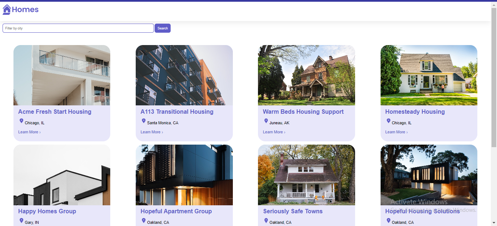

# Angular Homes App
- Install Angular if you don't have it installed

  `npm install -g @angular/cli`

- Clone the project

` `

- Install the dependencies

  `npm install` 

# This project integrated with Local standalone server (JSON-server)
- First create the Json-server. if the second time, there is no need to create JSON-server

  `npm install -g json-server`

- Second Start the JSON Server

  `json-server --watch db.json`

- Run the application 

  `ng serve`

 
 [Reference Video](https://www.youtube.com/playlist?list=PL1w1q3fL4pmj9k1FrJ3Pe91EPub2_h4jF)
